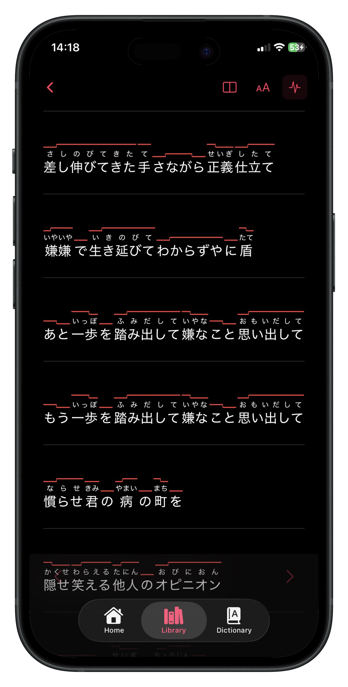

# Onpu

Native iOS app that turns Japanese song lyrics into a study tool. Paste a lyric, the backend runs it through Google Gemini for segmentation, reading, translation, and pitch-accent annotation, and the app renders it back with furigana over kanji, pitch lines over the text, line-by-line translations, and a long-press kanji dictionary. Once a song is processed it's cached locally (the studying part works offline).

Sanitized public extract of a private project. Commit history lives in the private source repo.

---

## Scope & status

Three moving parts — an iOS client, a Node backend, and a Next.js landing page — sitting in one repo for convenience. Backend is deployed at `app.onpu.app`; the app defaults to production and can be pointed at `localhost:3001` from an in-app debug screen during development (useful when iterating on prompts).

Solo project. AI-assisted during development (Claude Code for iteration). The text rendering, the pitch-accent drawing, the backend job shape, and the prompt engineering are my design; the tools do the scaffolding.

---

## Why this exists

Japanese song lyrics are where learners actually want to spend time (way more than in a textbook) but the standard tools fall apart on them. Lyrics are short, idiomatic, often stylised, and swing between kana-heavy and kanji-heavy lines in ways that break generic translators. Furigana overlays exist on the web, pitch accent mostly does not, and line-by-line translations that respect the song's register are rare.

The goal was one focused surface where all of those layers sit on top of the same lyric and can be toggled, saved, and studied later (online or off).

---

## Architecture

Three folders, three services.

### iOS client (`Uta/`)

- **Swift + SwiftUI** for the whole UI
- **SwiftData** for local persistence — saved songs, the user's kanji dictionary, metadata
- Custom text layout on top of **Core Text**, because the default SwiftUI text stack can't do everything this app needs at once: ruby annotations (furigana) above kanji, pitch-accent lines drawn at the right positions over the line, and per-character hit-testing so long-press on a single kanji opens the dictionary
- Debug toggle to point at a local backend without recompiling

### Backend (`backend/`)

- **Node.js + TypeScript + Fastify** as a thin HTTP layer in front of a Redis-backed job queue
- Two processes: **API** (accepts submissions, returns status and results) and **Worker** (runs the Gemini calls, writes the result). Split out so a slow Gemini call can't block incoming requests.
- **Redis** stores the queue and also carries stage updates back to the client ("Translating…", "Drawing pitch lines…") so the iOS UI can show staged progress instead of a silent spinner
- **Google Gemini** does the heavy lifting — segmentation, readings, translation, and pitch-accent annotation

### Landing page (`landing/`)

- **Next.js** static export served at `onpu.app`
- Intentionally minimal — it exists to give the App Store listing a marketing page and to host the privacy/support links. Not where the interesting code is.

---

## Why a job queue instead of a direct call

Processing a song isn't fast (10–30 seconds depending on length and Gemini load) and the user often backgrounds the app mid-way. Synchronous request/response is an obviously bad fit. With a queue: the app submits, can go to background, the worker grinds, the app picks up the result when it comes back, and the user sees staged progress instead of a blocked screen.

The staged progress bit came out of testing — a silent 20-second spinner feels broken, the same 20 seconds with "Analysing kanji → Translating → Drawing pitch lines" feels deliberate.

---

## Why Gemini and not OpenAI

Gemini's behaviour on Japanese lyrics was noticeably better in my testing — it kept register and context across lines, where OpenAI in the same price tier tended to flatten nuance into generic translation. It also has a more forgiving rate-limit story for a solo project at this scale. Not a religious choice; if the gap closes I'd switch.

---

## What's deliberately not here

- No account or cross-device sync — saved songs live on one device (keeping auth simple saved a lot of scope)
- No audio or playback — this is for studying lyrics, not listening to them
- No lyric transcription from audio — users paste known lyrics, the app analyses, not transcribes
- No community features, sharing, or leaderboards

---

---

# 🇵🇱 Wersja polska

Natywna aplikacja iOS, która zamienia tekst japońskiej piosenki w narzędzie do nauki. Wklejasz tekst, backend przepuszcza go przez Google Gemini (segmentacja, czytanie, tłumaczenie, akcent toniczny), a appka renderuje go z furiganą nad kanji, liniami akcentu tonicznego nad tekstem, tłumaczeniem linia po linii i słownikiem kanji pod przytrzymaniem. Raz przetworzona piosenka zostaje zapisana lokalnie (samo uczenie się działa bez internetu).

## Po co to istnieje

Teksty japońskich piosenek to miejsce, gdzie uczący się naprawdę chcą spędzać czas (dużo bardziej niż w podręczniku), ale standardowe narzędzia się na nich wykładają. Tekst piosenki jest krótki, idiomatyczny, często stylizowany i skacze między liniami pełnymi kany i kanji w sposób, który łamie zwykłe tłumacze. Furigana w sieci istnieje, akcent toniczny raczej nie — tak samo tłumaczenia linia po linii, które trzymają rejestr oryginału. Cel był prosty: jedna powierzchnia, gdzie wszystkie te warstwy leżą na tym samym tekście i można je włączać, zapisywać i wracać do nich (online albo offline).

## Jak to zbudowane

Trzy foldery, trzy serwisy.

**Klient iOS (`Uta/`)** — Swift + SwiftUI + SwiftData. Własny rendering tekstu zbudowany na Core Text (ruby dla furigany, rysowane linie akcentu tonacji, hit-testing na każdy znak do słownika), bo wbudowany stack SwiftUI nie robi tego wszystkiego naraz.

**Backend (`backend/`)** — Node.js + TypeScript + Fastify jako cienka warstwa HTTP przed kolejką na Redisie. Dwa procesy: API (przyjmuje zgłoszenia, zwraca status i wynik) i Worker (woła Gemini, zapisuje rezultat), rozdzielone po to, żeby wolne wywołanie Gemini nie blokowało API. Redis nie tylko trzyma kolejkę, ale też przekazuje do klienta aktualizacje etapów ("Translating…", "Drawing pitch lines…"), więc iOS pokazuje konkretny postęp zamiast cichego kręcącego się kółka.

**Landing (`landing/`)** — Next.js jako statyczny eksport na `onpu.app`. Minimalny — istnieje głównie pod link ze sklepu App Store i pod politykę prywatności.

## Dlaczego kolejka, a nie zwykły request/response

Przetworzenie piosenki trwa (10–60 sekund w zależności od długości i obciążenia Gemini), a użytkownik często w trakcie zamyka appkę. Synchroniczne API byłoby tu niepoprawne z definicji. Z kolejką: appka wysyła zgłoszenie, może pójść w tło, worker robi swoje, iOS odbiera wynik i pokazuje gotowy rezultat zamiast zawieszonego ekranu.

## Dlaczego Gemini, a nie OpenAI

W moich testach Gemini zachowywał się wyraźnie lepiej na japońskim tekście — trzymał rejestr i kontekst między liniami, podczas gdy OpenAI w tym samym przedziale cenowym spłaszczał niuanse do nudnego, pospolitego tłumaczenia. Plus ma łagodniejszą politykę rate-limitów dla projektu solo tej skali. To nie jest decyzja na zawsze — jeśli różnica się zamknie, przesiądę się.

## Stack

Swift · SwiftUI · SwiftData · Core Text · Node.js · TypeScript · Fastify · Redis · Google Gemini · Next.js

## License

Source-available for reference. Not licensed for redistribution or commercial use.
